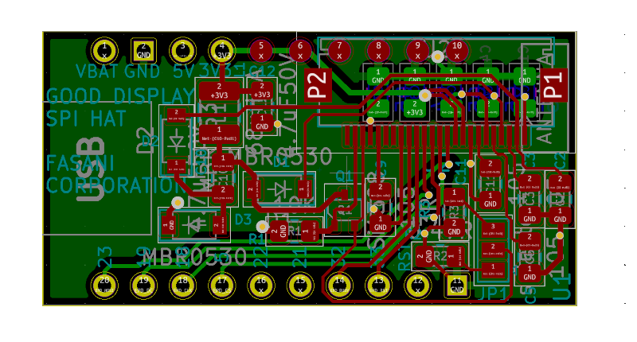

## Small SPI adapters

H stands for Hardware.

In this repository we will keep PCB designs done in KiCAD for SPI adapters we use. 

### UC8156 SPI adapter for Tinypico

Beginning of 2022 I started to learn KiCAD and get more into Hardware. My intention is to help people with their own projects and make new versions, first of existing adapters, to make them smaller and optimize certain things that, I think, could be make better.

My first product in this direction is the [Tinypico SPI adapter for UC8156 displays](https://www.tindie.com/products/fasani/tinypico-small-uc8156-epaper-hat).

The supported [displays are sold by German company PlasticLogic](https://www.plasticlogic.com/sampleshop).

## Goodisplay SPI adapter

This is currently being designed. There is a 3 pad's jumper in the PCB, this is what they called RESE option, different epapers might need either the 4.7 soldered to the center, others the 3. If this is wrong selected the epaper might fail to refresh.
Please check what is the right choice for your model downloading the [DESPI-co2 datasheet](https://www.good-display.com/companyfile/DESPI-C02-Specification-29.html).

## Other SPI adapters that might come

Goodisplay Tinypico ESP32 HAT (Idea) In Production, needs revisions from a higher hierarchie ;)

Other epapers.

Intention to make a mini-parallel epaper driver (Will be super hard design)

For more information and currect projects please check:

[https://fasani.de/pcb-design-projects](https://fasani.de/pcb-design-projects)
Most of the PCB's where designed using latest version of KiCAD when writing this lines ( V. 6 )
