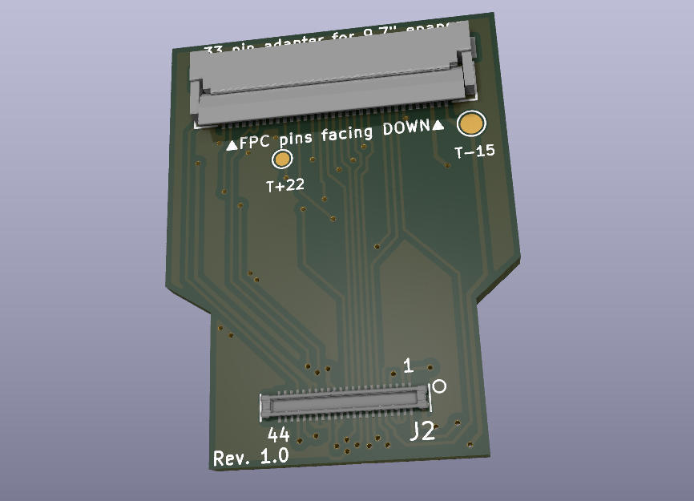

## Panasonic AXE544127A connector to a 33 pin FPC epaper connector

[AXE544127A](https://app.ultralibrarian.com/details/195de4da-7296-11e9-ab3a-0a3560a4cccc/Panasonic/AXE544127A) to a **XF2M-3315-1A** 33 pin connector which corresponds to 9.7" epaper displays (ED097OC4, ED097TCx and more)

In short: The aim of this adapter is to use a cheap Lilygo S3 board with all it's hardware additions (RTC, ESP32S3 with fast PSRAM and others) to power a much bigger display than the EPD047.

How it will fit the Lilygo S3 board:

